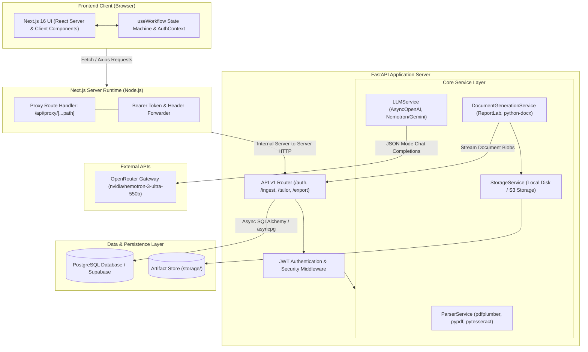
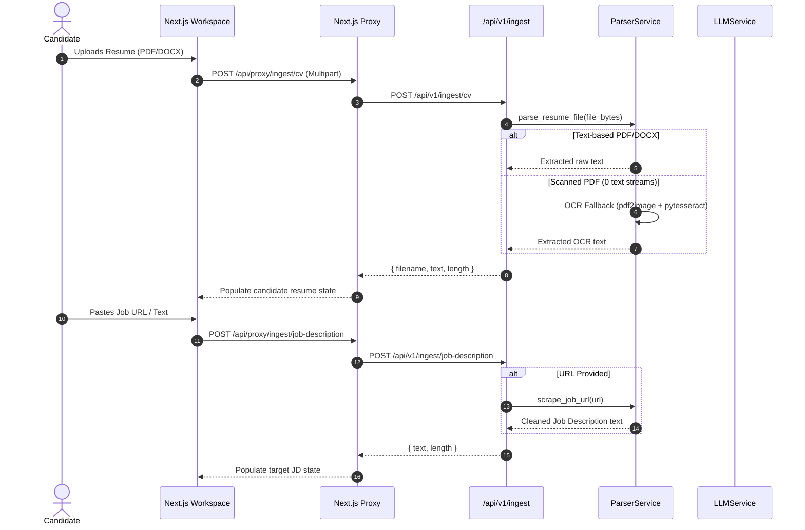
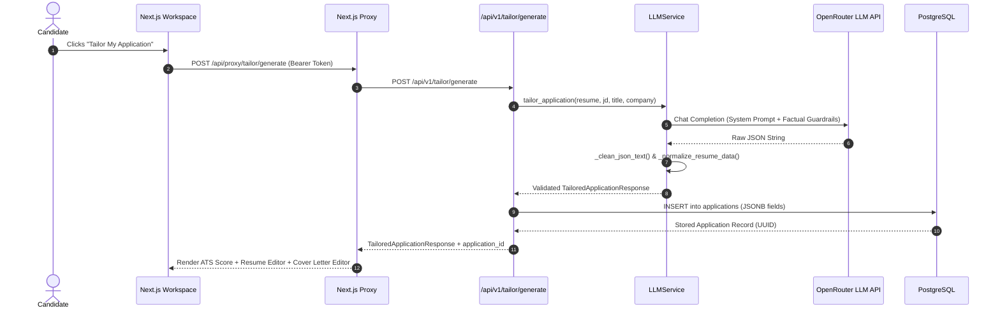
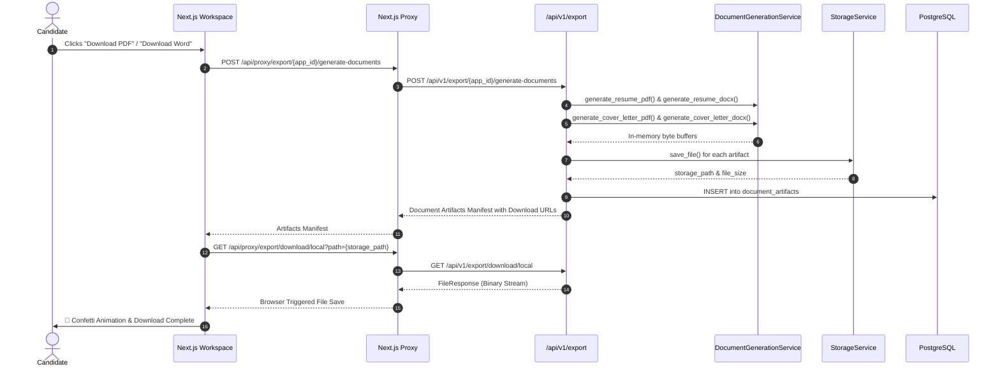
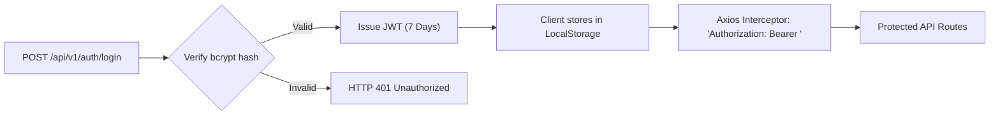

# System Architecture & Technical Scaffolding
## Project: TailorCraft AI — Automated Resume & Cover Letter Customization System

---

## 1. High-Level System Architecture

TailorCraft AI is built as a decoupled, high-throughput microservices architecture consisting of a **Next.js 16 (App Router)** client application, an internal **Server-Side Reverse Proxy**, a **FastAPI (Python 3.11+)** asynchronous backend engine, a **PostgreSQL (Supabase)** relational data store, and external **OpenRouter LLM Gateways**.



---

## 2. Component Scaffolding & Tier Breakdown

### 2.1 Presentation Tier (Frontend — Next.js 16)
* **Framework:** Next.js 16 App Router with React 19 and TypeScript 5.
* **Styling System:** Tailwind CSS v4 featuring CSS custom properties, HSL color tokens, dark-mode styling, and glassmorphism.
* **Component Modularization:**
  * `components/ingestion/`: File dropzone, raw text input, and live URL scraper trigger.
  * `components/analytics/`: Radial SVG ATS match gauge, score count-up animations, and keyword delta pills.
  * `components/workspace/`: Accordion-based CV sections (Summary, Experience XYZ bullets, Skills tag manager) and Cover Letter editor.
  * `components/export/`: Action controls, download progress indicators, and celebration triggers (`canvas-confetti`).
  * `components/ui/`: Navigation header, 4-step interactive progress breadcrumb, modal dialogs, and toast notifications.
* **State Management:**
  * Custom `useWorkflow` hook encapsulating a 4-phase finite state machine (`upload` $\to$ `job_description` $\to$ `tailor` $\to$ `export`).
  * React `AuthContext` providing global authentication state, token persistence in `localStorage`, and automated user profile sync.

### 2.2 Security & Proxy Tier (Next.js Server Proxy)
To eliminate Cross-Origin Resource Sharing (CORS) pitfalls, shield API tokens, and normalize streaming transfers, the frontend communicates with the backend through `/api/proxy/[...path]`:
* Forwards inbound HTTP headers (specifically `Authorization: Bearer <token>`).
* Relays `multipart/form-data` streams for CV uploads directly to FastAPI without intermediate buffering.
* Buffers or passes through binary streams (`application/pdf`, `application/vnd.openxmlformats-officedocument.wordprocessingml.document`) during export downloads.

### 2.3 Application Tier (Backend — FastAPI)
* **Asynchronous Execution:** Pure async request handling built on Starlette and Uvicorn.
* **Pydantic Validation:** Strict input/output validation models with Pydantic v2 schemas.
* **Layered Service Architecture:**
  * `app/api/v1/endpoints/`: Thin routing layer mapping HTTP verbs and status codes to services.
  * `app/services/`: Pure business logic and third-party integrations isolated from transport mechanisms.
  * `app/models/`: SQLAlchemy 2.0 declarative database models.
  * `app/core/`: Application settings via `pydantic-settings` and JWT cryptographic utilities.

### 2.4 Data Tier (PostgreSQL & Storage)
* **Database Engine:** PostgreSQL hosted on Supabase or local instance.
* **Driver & ORM:** `asyncpg` async driver with SQLAlchemy 2.0 ORM session scoping.
* **Migration Management:** Alembic declarative version tracking.
* **Binary Artifact Storage:** Storage abstraction layer supporting local filesystem storage with ready expansion for AWS S3 and Cloudflare R2.

---

## 3. End-to-End Data Flow Pipelines

### 3.1 Ingestion & Parsing Data Flow



### 3.2 AI Tailoring & Anti-Hallucination Pipeline



### 3.3 Multi-Format Export & Download Pipeline



---

## 4. Security & Network Architecture

### 4.1 CORS Bypass & Reverse Proxy Pattern
To safeguard the backend against direct client inspection and eliminate CORS preflight latency:
1. Browser only talks to origin `http://localhost:3000` (or production domain).
2. Next.js Route Handler `/api/proxy/[...path]` acts as an authorized gateway forwarder to `http://127.0.0.1:8000/api/v1`.
3. Inbound request authorization tokens are validated and forwarded seamlessly.

### 4.2 Authentication & Token Handling
* **Standard:** HMAC-SHA256 Signed JSON Web Tokens (JWT).
* **Payload:** Subject (`sub`: User UUID), expiration (`exp`), and issued-at (`iat`).
* **Protection:** Injected automatically via Axios request interceptors on client operations requiring user ownership.



---

## 5. Repository Scaffolding & Code Organization

```
TailorCraft-AI/
├── backend/
│   ├── alembic/                       # Alembic migrations configuration
│   │   ├── versions/                  # Individual migration revision scripts
│   │   └── env.py                     # Async engine configuration for migrations
│   ├── app/
│   │   ├── api/
│   │   │   └── v1/
│   │   │       └── endpoints/         # REST API routers
│   │   │           ├── auth.py        # Login, registration, profile retrieval
│   │   │           ├── ingestion.py   # CV parsing and URL scraping
│   │   │           ├── tailor.py      # Job analysis, ATS score, tailor generation
│   │   │           └── export.py      # Artifact compilation and file downloads
│   │   ├── core/
│   │   │   ├── config.py              # Pydantic BaseSettings (.env loading)
│   │   │   └── security.py            # Password hashing & JWT creation/verification
│   │   ├── db/
│   │   │   ├── base.py                # Declarative Base import aggregator
│   │   │   └── session.py             # Async SQLAlchemy sessionmaker
│   │   ├── models/
│   │   │   └── models.py              # User, Application, DocumentArtifact ORM models
│   │   ├── schemas/
│   │   │   ├── ai.py                  # ATS, JobAnalysis, and Tailored payloads
│   │   │   ├── resume.py              # StructuredResume, Experience, Skills schemas
│   │   │   └── user.py                # UserCreate, UserResponse, Token schemas
│   │   ├── services/
│   │   │   ├── document_service.py    # ReportLab & python-docx binary builders
│   │   │   ├── llm_service.py         # OpenRouter AsyncOpenAI client & prompts
│   │   │   ├── parser_service.py      # pdfplumber, docx, OCR, BeautifulSoup
│   │   │   └── storage_service.py     # Local file system / S3 storage abstraction
│   │   └── main.py                    # FastAPI entrypoint, middleware, routers
│   ├── storage/                       # Local runtime directory for generated files
│   ├── alembic.ini                    # Alembic environment config
│   ├── requirements.txt               # Backend Python dependencies
│   └── .env.example                   # Environment configuration template
│
├── frontend/
│   ├── src/
│   │   ├── app/
│   │   │   ├── api/proxy/[...path]/   # Next.js server-side reverse proxy
│   │   │   ├── globals.css            # Dark mode tokens, animations, custom scrollbars
│   │   │   ├── layout.tsx             # Root layout with AuthProvider & metadata
│   │   │   └── page.tsx               # Main single-page interactive workspace
│   │   ├── components/
│   │   │   ├── analytics/             # AtsScoreGauge, KeywordBadges
│   │   │   ├── export/                # ExportBar, DownloadHandler
│   │   │   ├── ingestion/             # ResumeUploader, JobDescriptionInput
│   │   │   ├── ui/                    # Header, StepIndicator, AuthModal, Toast
│   │   │   └── workspace/             # TailoredResumeEditor, CoverLetterEditor
│   │   ├── context/
│   │   │   └── AuthContext.tsx        # Authentication provider & user session
│   │   ├── hooks/
│   │   │   └── useWorkflow.ts         # Multi-step state machine
│   │   ├── lib/
│   │   │   ├── api.ts                 # Axios instance with proxy base URL
│   │   │   └── utils.ts               # CSS class utility helper
│   │   └── types/
│   │       └── index.ts               # Shared TypeScript interfaces
│   ├── package.json                   # Node.js dependencies & scripts
│   ├── tsconfig.json                  # TypeScript compiler configuration
│   └── next.config.ts                 # Next.js framework configuration
│
└── docs/                              # Comprehensive Technical Documentation
    ├── SRS.md                         # Software Requirements Specification
    ├── ARCHITECTURE.md                # System Architecture & Scaffolding
    ├── SDD.md                         # Software Design Description & Module Logic
    ├── DATABASE_SCHEMA.md             # PostgreSQL Schema, ERD, Data Dictionary
    ├── API_SPECIFICATION.md           # REST API Contracts, Payloads, & Headers
    ├── TESTING_STRATEGY.md            # Testing Matrix & ATS Benchmark Suite
    └── DEPLOYMENT.md                  # CI/CD, Docker, & Environment Provisioning
```
