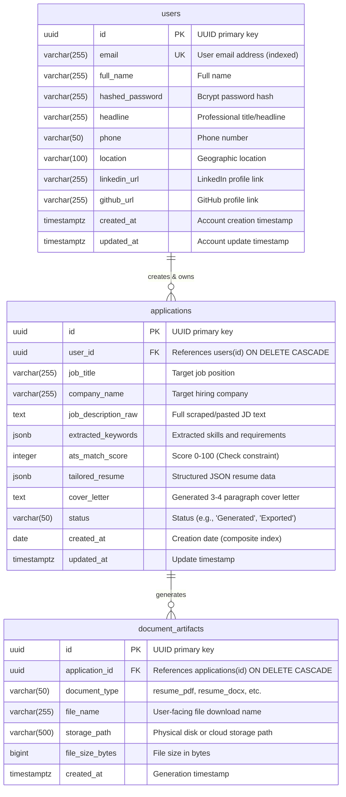

# Database Schema & Data Dictionary
## Project: TailorCraft AI — Automated Resume & Cover Letter Customization System

---

## 1. Entity-Relationship Diagram (ERD)

The database schema is implemented in PostgreSQL (via Supabase or standalone instance) using SQLAlchemy 2.0 and Alembic.



---

## 2. PostgreSQL DDL Specification

```sql
-- Enable UUID extension
CREATE EXTENSION IF NOT EXISTS "uuid-ossp";

-- Table: users
CREATE TABLE users (
    id UUID PRIMARY KEY DEFAULT uuid_generate_v4(),
    email VARCHAR(255) NOT NULL UNIQUE,
    full_name VARCHAR(255) NOT NULL,
    hashed_password VARCHAR(255) NOT NULL,
    headline VARCHAR(255),
    phone VARCHAR(50),
    location VARCHAR(100),
    linkedin_url VARCHAR(255),
    github_url VARCHAR(255),
    created_at TIMESTAMP WITH TIME ZONE DEFAULT CURRENT_TIMESTAMP,
    updated_at TIMESTAMP WITH TIME ZONE DEFAULT CURRENT_TIMESTAMP
);

CREATE INDEX idx_users_email ON users(email);

-- Table: applications
CREATE TABLE applications (
    id UUID PRIMARY KEY DEFAULT uuid_generate_v4(),
    user_id UUID NOT NULL,
    job_title VARCHAR(255) NOT NULL,
    company_name VARCHAR(255) NOT NULL,
    job_description_raw TEXT NOT NULL,
    extracted_keywords JSONB,
    ats_match_score INTEGER,
    tailored_resume JSONB,
    cover_letter TEXT,
    status VARCHAR(50) DEFAULT 'Generated',
    created_at DATE NOT NULL DEFAULT CURRENT_DATE,
    updated_at TIMESTAMP WITH TIME ZONE DEFAULT CURRENT_TIMESTAMP,
    CONSTRAINT fk_applications_user FOREIGN KEY (user_id) REFERENCES users(id) ON DELETE CASCADE,
    CONSTRAINT chk_ats_match_score CHECK (ats_match_score >= 0 AND ats_match_score <= 100)
);

CREATE INDEX idx_applications_user_id ON applications(user_id);
CREATE INDEX idx_applications_date_job ON applications(created_at, job_title, company_name);

-- Table: document_artifacts
CREATE TABLE document_artifacts (
    id UUID PRIMARY KEY DEFAULT uuid_generate_v4(),
    application_id UUID NOT NULL,
    document_type VARCHAR(50) NOT NULL,
    file_name VARCHAR(255) NOT NULL,
    storage_path VARCHAR(500) NOT NULL,
    file_size_bytes BIGINT,
    created_at TIMESTAMP WITH TIME ZONE DEFAULT CURRENT_TIMESTAMP,
    CONSTRAINT fk_artifacts_application FOREIGN KEY (application_id) REFERENCES applications(id) ON DELETE CASCADE
);

CREATE INDEX idx_artifacts_application_id ON document_artifacts(application_id);
```

---

## 3. Data Dictionary

### 3.1 Table: `users`
Represents registered candidate accounts and default profile metadata.

| Column Name | Data Type | Nullable | Default | Constraints / Indexes | Description |
| :--- | :--- | :---: | :--- | :--- | :--- |
| `id` | `UUID` | No | `uuid_generate_v4()` | `PRIMARY KEY` | Unique user identifier |
| `email` | `VARCHAR(255)` | No | — | `UNIQUE`, Indexed | Candidate email address for login |
| `full_name` | `VARCHAR(255)` | No | — | — | Full legal name of the candidate |
| `hashed_password`| `VARCHAR(255)` | No | — | — | Bcrypt salted password hash |
| `headline` | `VARCHAR(255)` | Yes | `NULL` | — | Current professional title / role |
| `phone` | `VARCHAR(50)` | Yes | `NULL` | — | Contact telephone number |
| `location` | `VARCHAR(100)` | Yes | `NULL` | — | City, State, Country |
| `linkedin_url` | `VARCHAR(255)` | Yes | `NULL` | — | LinkedIn profile URL |
| `github_url` | `VARCHAR(255)` | Yes | `NULL` | — | GitHub profile URL |
| `created_at` | `TIMESTAMPTZ` | No | `CURRENT_TIMESTAMP` | — | Account creation timestamp |
| `updated_at` | `TIMESTAMPTZ` | No | `CURRENT_TIMESTAMP` | — | Account profile last update timestamp |

---

### 3.2 Table: `applications`
Stores tailored application records, original job requirements, structured CV JSON, and ATS metrics.

| Column Name | Data Type | Nullable | Default | Constraints / Indexes | Description |
| :--- | :--- | :---: | :--- | :--- | :--- |
| `id` | `UUID` | No | `uuid_generate_v4()` | `PRIMARY KEY` | Unique application run identifier |
| `user_id` | `UUID` | No | — | `FK -> users.id (CASCADE)` | Owning user identifier |
| `job_title` | `VARCHAR(255)` | No | — | Composite Index | Parsed or user-provided target job title |
| `company_name` | `VARCHAR(255)` | No | — | Composite Index | Target hiring employer |
| `job_description_raw`| `TEXT` | No | — | — | Complete raw job description text |
| `extracted_keywords` | `JSONB` | Yes | `NULL` | — | Structured JSON of extracted skills & responsibilities |
| `ats_match_score` | `INTEGER` | Yes | `NULL` | `CHECK (0 <= score <= 100)` | Computed ATS compatibility rating |
| `tailored_resume` | `JSONB` | Yes | `NULL` | — | Tailored resume schema (Summary, XYZ Experience, Skills) |
| `cover_letter` | `TEXT` | Yes | `NULL` | — | 3-4 paragraph generated cover letter text |
| `status` | `VARCHAR(50)` | No | `'Generated'` | — | Lifecycle status (`Draft`, `Generated`, `Exported`) |
| `created_at` | `DATE` | No | `CURRENT_DATE` | Composite Index | Date application was tailored |
| `updated_at` | `TIMESTAMPTZ` | No | `CURRENT_TIMESTAMP` | — | Last modification timestamp |

---

### 3.3 Table: `document_artifacts`
Tracks physical binary documents compiled for download.

| Column Name | Data Type | Nullable | Default | Constraints / Indexes | Description |
| :--- | :--- | :---: | :--- | :--- | :--- |
| `id` | `UUID` | No | `uuid_generate_v4()` | `PRIMARY KEY` | Unique artifact identifier |
| `application_id`| `UUID` | No | — | `FK -> applications.id (CASCADE)` | Associated tailored application |
| `document_type` | `VARCHAR(50)` | No | — | — | `resume_pdf`, `resume_docx`, `cover_letter_pdf`, `cover_letter_docx` |
| `file_name` | `VARCHAR(255)` | No | — | — | File name presented during download |
| `storage_path` | `VARCHAR(500)` | No | — | — | Internal filesystem or object storage key |
| `file_size_bytes`| `BIGINT` | Yes | `NULL` | — | Exact binary size in bytes |
| `created_at` | `TIMESTAMPTZ` | No | `CURRENT_TIMESTAMP` | — | Compilation timestamp |

---

## 4. JSONB Schema Formats

### 4.1 `applications.extracted_keywords` JSON Structure
```json
{
  "job_title": "Senior Full-Stack Engineer",
  "company_name": "Acme Cloud Technologies",
  "hard_skills": ["Python", "FastAPI", "React", "TypeScript", "PostgreSQL", "Docker", "AWS"],
  "soft_skills": ["Cross-functional collaboration", "Agile leadership", "Problem solving"],
  "key_responsibilities": [
    "Design and scale high-throughput asynchronous REST APIs",
    "Architect responsive Next.js frontend interfaces"
  ],
  "qualifications": [
    "5+ years of software engineering experience",
    "B.S. in Computer Science or equivalent practical experience"
  ]
}
```

### 4.2 `applications.tailored_resume` JSON Structure
```json
{
  "contact_info": {
    "full_name": "Jane Doe",
    "email": "jane.doe@example.com",
    "phone": "+1 (555) 019-2834",
    "location": "San Francisco, CA",
    "linkedin_url": "https://linkedin.com/in/janedoe",
    "github_url": "https://github.com/janedoe",
    "portfolio_url": "https://janedoe.dev"
  },
  "professional_summary": "Results-driven Full-Stack Engineer with 6+ years of expertise in FastAPI, Next.js, and distributed PostgreSQL architectures. Proven track record of improving system throughput by 40% and deploying mission-critical AI-driven applications.",
  "work_experience": [
    {
      "company_name": "Innovatech Solutions",
      "job_title": "Lead Software Engineer",
      "location": "San Francisco, CA",
      "start_date": "2021",
      "end_date": "Present",
      "is_current": true,
      "bullet_points": [
        "Architected async microservices using FastAPI and PostgreSQL, boosting API response latency by 35% across 2M daily requests.",
        "Engineered automated CI/CD deployment pipelines using Docker and GitHub Actions, reducing release cycle duration from 4 days to 2 hours."
      ]
    }
  ],
  "education": [
    {
      "institution": "University of California, Berkeley",
      "degree": "Bachelor of Science",
      "field_of_study": "Computer Science",
      "graduation_year": "2018",
      "gpa_or_grade": "3.85 / 4.0"
    }
  ],
  "certifications": [
    {
      "name": "AWS Certified Solutions Architect – Associate",
      "issuing_organization": "Amazon Web Services",
      "issue_date": "2023",
      "credential_id": "AWS-829104"
    }
  ],
  "skills": {
    "technical_skills": ["Python", "TypeScript", "SQL", "FastAPI", "React", "Next.js"],
    "soft_skills": ["Technical Mentorship", "System Design", "Agile Scrum"],
    "tools_and_frameworks": ["Docker", "PostgreSQL", "Tailwind CSS", "Git", "Alembic"]
  }
}
```

---

## 5. Indexing & Migration Management

### 5.1 Composite Indexes
* **`idx_applications_date_job` on `(created_at, job_title, company_name)`:** Optimizes analytics dashboard queries and historical job filtering.
* **`idx_users_email`:** Enforces fast $O(1)$ user authentication lookups.

### 5.2 Alembic Migration Workflow
```bash
# Generate a new declarative migration script
alembic revision --autogenerate -m "create_initial_tailorcraft_tables"

# Apply migrations to Supabase / PostgreSQL database
alembic upgrade head
```
