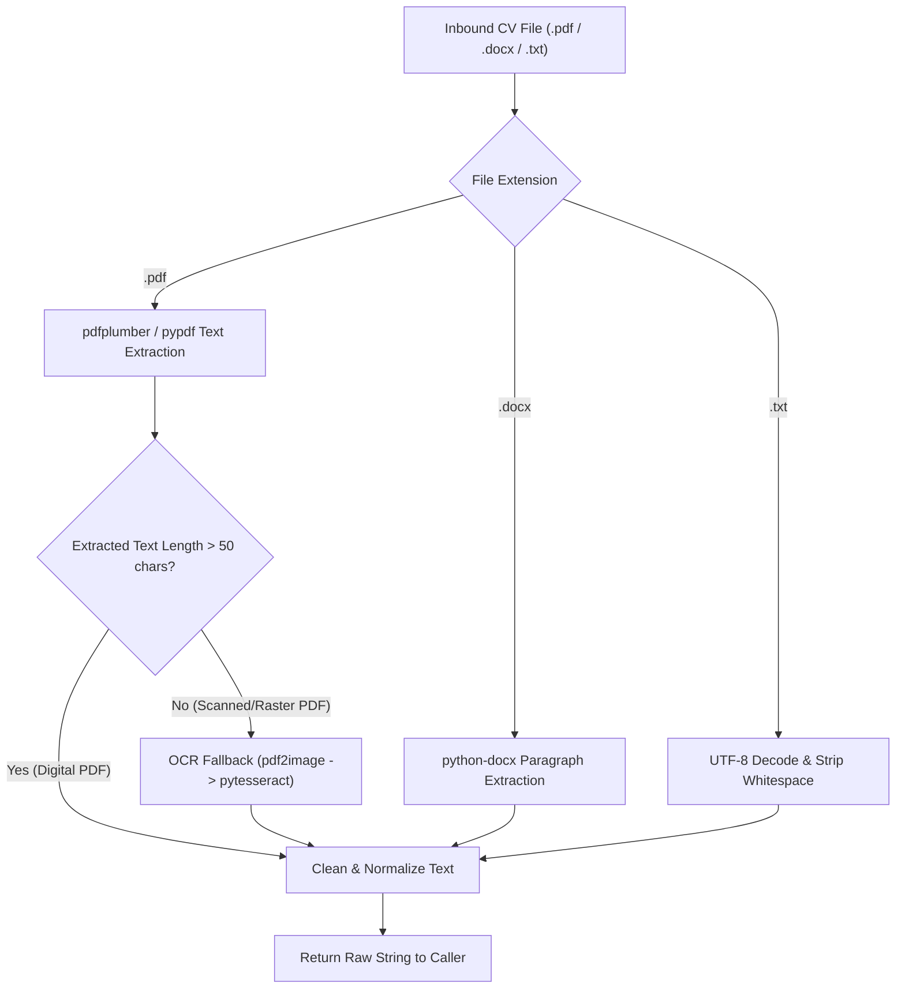
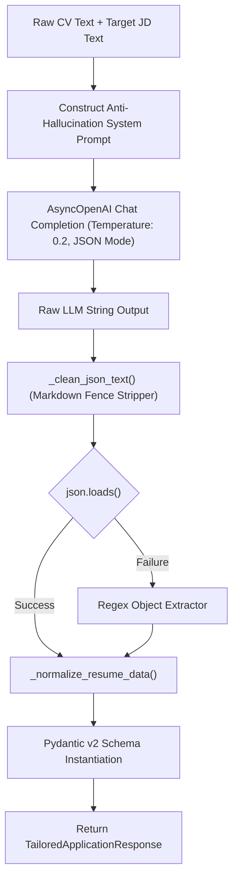
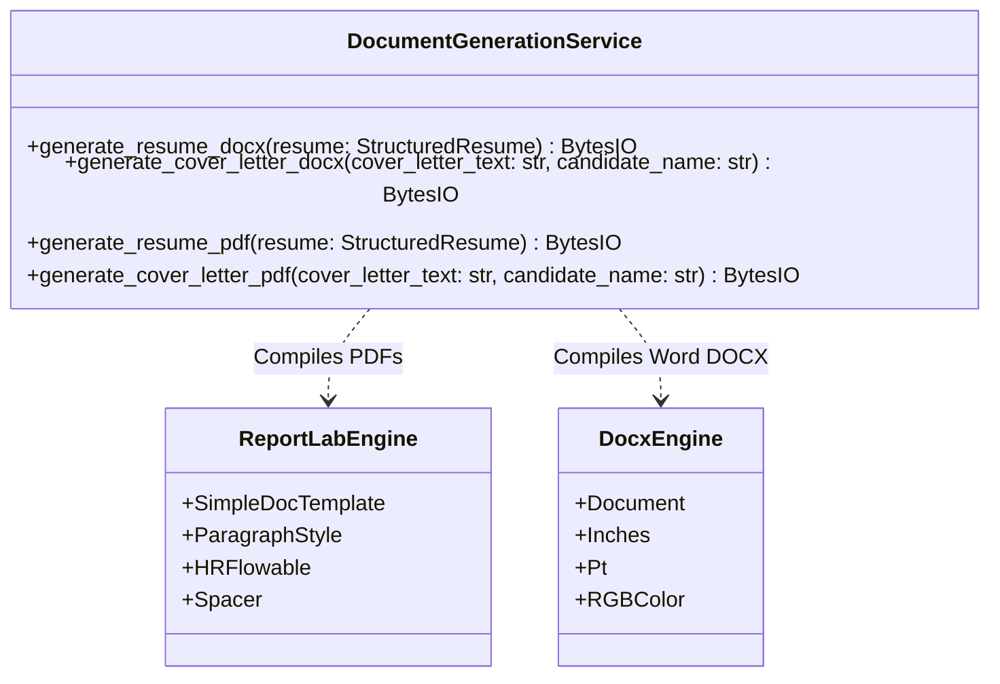
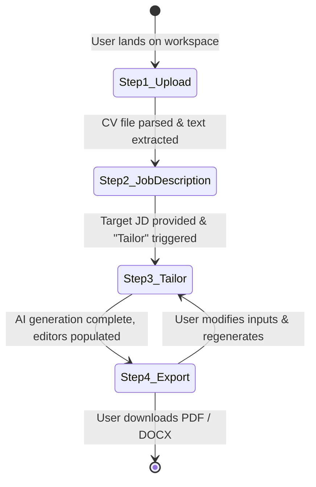

# Software Design Description (SDD) & Module Logic
## Project: TailorCraft AI — Automated Resume & Cover Letter Customization System

---

## 1. Introduction & Design Principles

The Software Design Description (SDD) provides the internal algorithmic details, class designs, state machine transitions, and data transformations implemented across all subsystems of **TailorCraft AI**.

### Core Design Principles:
1. **Context-Bound Anti-Hallucination:** AI engines operate under strict factual containment. No candidate credentials, titles, or dates may be invented.
2. **Defensive Data Normalization:** Backend services never trust raw LLM JSON outputs directly; robust normalizers repair structural discrepancies before returning responses.
3. **In-Memory Streaming:** Document generation operates purely within memory buffers (`io.BytesIO`) to maximize I/O throughput and eliminate temporary file leaks.
4. **State Machine-Driven UI:** Frontend transitions strictly through deterministic workflow stages.

---

## 2. Ingestion & Document Parser Engine (`ParserService`)

The `ParserService` handles ingestion from heterogeneous resume formats and job description sources.

### 2.1 PDF Ingestion & OCR Fallback Pipeline
1. **Primary Extraction:** Extracts text character-by-character using `pdfplumber`. If `pdfplumber` fails or encounters non-standard font encodings, it falls back to `pypdf.PdfReader`.
2. **Scanned PDF Detection:** If the extracted text contains fewer than 50 characters across all pages, the document is flagged as an image-only scan.
3. **OCR Processing:** Converts PDF pages into high-resolution PIL images via `pdf2image.convert_from_bytes(dpi=300)` and runs Tesseract OCR (`pytesseract.image_to_string`).

### 2.2 Live Web Job Description Scraper
* **Input:** Target job post URL (e.g., LinkedIn, Greenhouse, Lever, Indeed).
* **Sanitization:** Fetches HTML using `httpx` with standard desktop `User-Agent` headers.
* **Extraction:** Uses `BeautifulSoup4` to strip `<script>`, `<style>`, `<nav>`, and `<footer>` tags, extracting dense text from `<main>`, `<article>`, or role-specific `
` containers.

---

## 3. AI Reasoning Engine & Anti-Hallucination Pipeline (`LLMService`)

The `LLMService` utilizes OpenRouter to communicate with advanced LLMs (`nvidia/nemotron-3-ultra-550b-a55b:free` or `google/gemini`).

### 3.1 Google XYZ Formula Transformation Engine
The AI engine is prompted to restructure work experience achievements according to Google's standard XYZ paradigm:

$$\text{Bullet Point} = \text{Accomplished } [X] \text{ as measured by } [Y] \text{, by doing } [Z]$$

* **$X$ (Action & Accomplishment):** High-impact action verb and clear business outcome (e.g., *"Accelerated database query execution"*).
* **$Y$ (Measurable Metric):** Quantifiable metric or KPI (e.g., *"by 42%, reducing p99 latency from 850ms to 490ms"*).
* **$Z$ (Method / Technology):** Concrete tooling, architecture, or algorithmic solution (e.g., *"by introducing Redis caching layer and optimizing composite PostgreSQL indexes"*).

### 3.2 Anti-Hallucination Enforcement Rules
The system prompt injects immutable guardrails:
1. **Zero Fictional Data:** Prohibits creating companies, colleges, job titles, or dates not explicitly present in the original CV.
2. **Context-Bound Keyword Bridging:** Missing skills from the job description are integrated *only* where candidate experience supports the assertion (e.g., transforming generic "API development" into "RESTful API development using FastAPI").
3. **Pervasive Fallbacks:** Missing fields are converted to `null` or empty lists rather than dummy placeholders like `"John Doe"` or `"N/A"`.

### 3.3 Self-Healing JSON Normalizer (`_normalize_resume_data`)
Because LLMs occasionally output non-standard JSON, `_normalize_resume_data` provides defensive normalization:
* **Contact Info Cleaning:** Strips string artifacts like `"null"`, `"None"`, or `"or null"` into genuine Python `None` types.
* **Score Clamping:** Forces `overall_match_score` into an integer range $[0, 100]$.
* **Structure Defense:** Ensures arrays (`work_experience`, `education`, `skills`) exist even if the LLM omitted the keys.

---

## 4. Multi-Format Document Generation Engine (`DocumentGenerationService`)

TailorCraft AI includes an in-memory document compilation engine generating **PDF** and **DOCX** files.

### 4.1 ReportLab PDF Compiler Logic
* **Page Budget & Geometry:** Standard Letter size with uniform $0.75\text{ in}$ ($54\text{ pt}$) margins.
* **Typography Palette:**
  * Candidate Name: Helvetica-Bold ($18\text{ pt}$, primary slate color `#1E293B`).
  * Section Headers: Helvetica-Bold ($11\text{ pt}$, uppercase, primary slate).
  * Body Text: Helvetica ($9.5\text{ pt}$, leading $13\text{ pt}$, charcoal `#334155`).
* **Visual Dividers:** `HRFlowable` horizontal rules ($0.75\text{ pt}$ thickness in slate blue `#3B82F6` or muted gray `#CBD5E1`) separating sections.
* **Page Break Control:** Headings and sub-entries employ `keepWithNext=True` on paragraph styles to eliminate orphan headers at page bottoms.

### 4.2 python-docx Word Compiler Logic
* **Document Margins:** Set to $0.75\text{ in}$ on all sections.
* **Font Hierarchy:** Calibri font family across all paragraph runs.
* **Bullet Point Formatting:** Native `'List Bullet'` Word style with compact paragraph spacing ($2\text{ pt}$ after) to preserve compact single/two-page layouts.

---

## 5. Storage & Persistence Engine (`StorageService`)

The `StorageService` isolates the application from physical storage infrastructure:
* **Deterministic File Naming:** Artifacts follow the pattern:
  $$\text{Path} = \text{storage/} \langle\text{application\_id}\rangle \text{/} \langle\text{document\_type}\rangle \text{\_} \langle\text{timestamp}\rangle \text{.} \langle\text{ext}\rangle$$
* **Metadata Recording:** For every generated document, records are persisted to `document_artifacts` with `file_size_bytes`, `storage_path`, and `document_type`.

---

## 6. Frontend State Machine & Workspace Components

The frontend is orchestrated via a deterministic finite state machine implemented in `useWorkflow.ts`.

### 6.1 State Machine Workflow States
1. **`upload` (Step 1):** Drag & drop CV ingestion. Validates file format and extracts text.
2. **`job_description` (Step 2):** Ingests raw JD or scrapes target URL. Computes preliminary ATS gap preview.
3. **`tailoring` (Step 3):** Displays animated pulse state while FastAPI and OpenRouter process the payload.
4. **`export` (Step 4):** Unlocks dual-panel workspace:
   * **Left Panel:** Accordion Resume Editor (Summary, XYZ Experience Bullets, Tagged Skills).
   * **Right Panel:** Live Cover Letter Editor + Radial ATS Score Gauge.
   * **Action Bar:** Instant download handlers for Resume (PDF/DOCX) and Cover Letter (PDF/DOCX).
