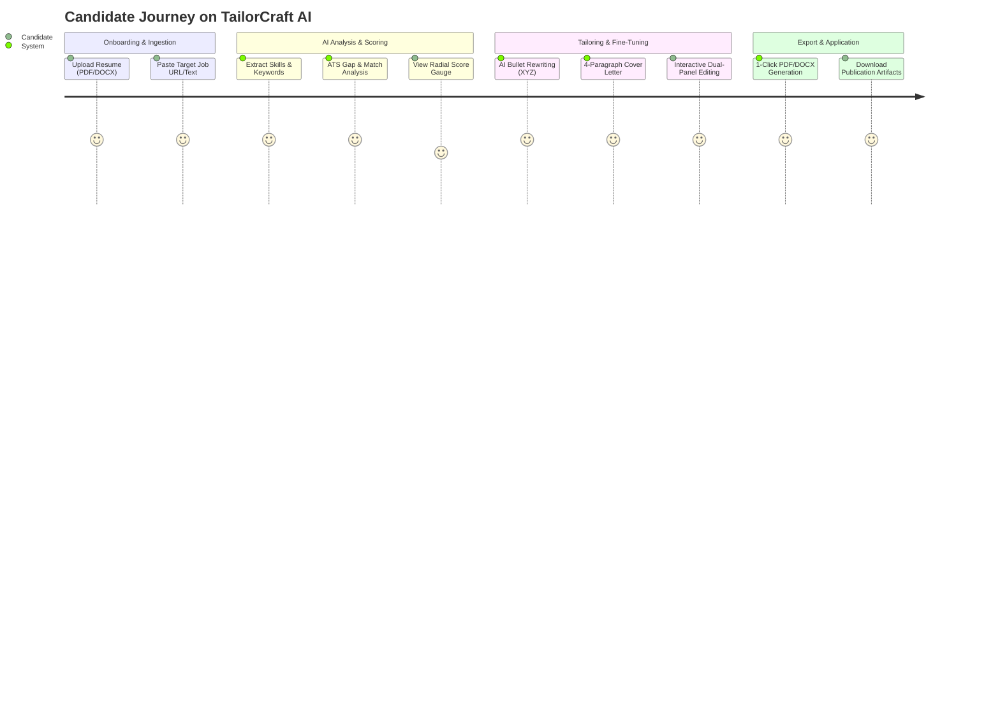

# Software Requirements Specification (SRS)
## Project: TailorCraft AI — Automated Resume & Cover Letter Customization System

---

## 1. Introduction

### 1.1 Purpose
The purpose of this Software Requirements Specification (SRS) is to define the complete functional, non-functional, domain, and interface requirements for **TailorCraft AI**. TailorCraft AI is an automated, context-bound career engineering platform designed to eliminate the friction between job seekers and Applicant Tracking Systems (ATS).

### 1.2 Scope of the System
TailorCraft AI ingests candidate resumes (`.pdf`, `.docx`, `.txt`) and target job descriptions (via raw text paste or direct URL scraping). The system performs deep semantic analysis, extracts critical skills and qualifications, calculates ATS match fidelity (0–100%), restructures professional experience using Google's **XYZ Formula** (*"Accomplished [X] as measured by [Y], by doing [Z]"*), and generates tailored, high-converting resumes and cover letters exported as publication-ready **PDF** and **DOCX** files.

### 1.3 Target Audience & Stakeholders
* **Job Seekers / Candidates:** Professionals, new graduates, and career changers seeking to maximize interview callback rates.
* **Technical Recruiters / ATS Evaluators:** Target benchmark consumers whose automated screening rules TailorCraft AI models.
* **System Administrators & Developers:** Engineers maintaining, extending, and operating the backend microservices, database, and frontend interfaces.

### 1.4 Definitions, Acronyms, and Abbreviations
* **ATS:** Applicant Tracking System (automated resume parsing and filtering software like Workday, Greenhouse, Lever, Taleo).
* **XYZ Formula:** Standardized bullet-point achievement structure: *"Accomplished [X] as measured by [Y], by doing [Z]"*.
* **JSONB:** Binary JSON column format in PostgreSQL used for schema-flexible structured storage.
* **OCR:** Optical Character Recognition (used as fallback for scanned or rasterized PDF resumes).
* **JWT:** JSON Web Token (RFC 7519) utilized for stateless user authentication.
* **LLM:** Large Language Model (e.g., Nvidia Nemotron 3 Ultra 550B, Google Gemini via OpenRouter).

---

## 2. User Personas & Use Case Scenarios

### 2.1 Persona Definitions

#### Persona 1: "David" — Senior Software Engineer
* **Background:** 7+ years of experience with diverse technologies. Applying to tier-1 tech companies.
* **Pain Point:** Has extensive experience but gets rejected due to missing domain-specific buzzwords or non-standard formatting parsed poorly by legacy ATS parsers.
* **Need:** Automated extraction of high-frequency keywords, bullet point restructuring into metrics-driven XYZ format, and clean, single-column DOCX/PDF export.

#### Persona 2: "Elena" — Career Pivot / Product Manager
* **Background:** Transitioning from Business Analyst to Product Manager.
* **Pain Point:** Hard to bridge previous cross-functional achievements with target PM job requirements; cover letters take hours to write per role.
* **Need:** Intelligent skill mapping, targeted 4-paragraph cover letters highlighting transferable qualifications, and side-by-side editable workspace.

#### Persona 3: "Amina" — Recent Graduate / Entry-Level Analyst
* **Background:** Limited formal job experience, high academic and project credentials.
* **Pain Point:** Doesn't know how to pass automated ATS filters or articulate academic accomplishments as measurable outcomes.
* **Need:** Guided ATS score gap analysis showing matched vs. missing skills, with instant actionable suggestions.

---

## 3. Functional Requirements (FR)

### Module 1: Ingestion & Document Parsing
* **FR-1.1:** System shall accept resume uploads in `.pdf`, `.docx`, and `.txt` formats up to 15 MB in size.
* **FR-1.2:** System shall extract raw textual content preserving structural section breaks using `pdfplumber` and `pypdf`.
* **FR-1.3:** System shall provide OCR fallback using `pdf2image` and `pytesseract` when uploaded PDFs contain zero extractable text streams (scanned documents).
* **FR-1.4:** System shall ingest job descriptions via direct multi-line text input or live URL scraping with `BeautifulSoup4` and header spoofing.
* **FR-1.5:** System shall sanitize extracted inputs to prevent prompt injection and character encoding corruptions (UTF-8 normalization).

### Module 2: AI Analysis, ATS Gap Scoring & Tailoring
* **FR-2.1:** System shall perform structured semantic parsing of job descriptions, isolating:
  * Target Job Title & Target Company Name.
  * Required Hard Skills and Core Technical Competencies.
  * Essential Soft Skills and Leadership Attributes.
  * Key Day-to-Day Responsibilities & Minimum Qualifications.
* **FR-2.2:** System shall calculate an **ATS Overall Match Score (0–100%)** comparing candidate resume text against target job requirements.
* **FR-2.3:** System shall return an itemized skill gap breakdown consisting of:
  * `matched_skills`: Exact and semantic matches between CV and JD.
  * `missing_skills`: High-priority target job keywords absent from the candidate resume.
  * `improvement_recommendations`: Actionable recommendations to boost ATS pass rates.
* **FR-2.4 (Anti-Hallucination Guardrails):** The AI tailoring engine shall strictly adhere to factual accuracy constraints:
  * It shall NEVER invent fictional past employers, job titles, educational degrees, or unearned certifications.
  * It shall only rewrite and enhance verified candidate experiences by weaving missing keywords into Google XYZ-formatted bullets.
* **FR-2.5:** System shall generate a targeted, professional 3-to-4 paragraph cover letter contextualizing candidate achievements against company mission.

### Module 3: Dual-Panel Interactive Workspace
* **FR-3.1:** System shall present an interactive dual-panel editor supporting real-time editing of:
  * Full Name, Email, Phone, Location, LinkedIn, GitHub, and Portfolio URLs.
  * Professional Summary.
  * Work Experience entries (Company, Role, Dates, and individual editable XYZ bullet points).
  * Education, Certifications, and categorizeable Skill tags (Technical, Soft, Tools).
* **FR-3.2:** System shall provide an inline Cover Letter rich-text editor with dynamic live word counting and optimal length validation indicators (target: 250–400 words).
* **FR-3.3:** System shall render a radial SVG ATS Match Gauge with animated count-up and color-coded status rings (Red `<50%`, Amber `50–74%`, Emerald `≥75%`).

### Module 4: Multi-Format Document Compilation & Export
* **FR-4.1:** System shall compile structured resume data into ATS-friendly **PDFs** using ReportLab, enforcing standard margins (0.75 in), clean typography, and parser-friendly text hierarchy.
* **FR-4.2:** System shall compile structured resumes into editable **DOCX** files using `python-docx` with standard header hierarchy and native bullet styles.
* **FR-4.3:** System shall compile tailored cover letters into matching styled **PDF** and **DOCX** files.
* **FR-4.4:** System shall store generated document binaries in storage (local persistent filesystem or S3/Supabase Storage) and register records in `document_artifacts`.
* **FR-4.5:** System shall stream binary file downloads directly to the client browser with accurate `Content-Disposition` attachment headers.

### Module 5: User Management & Application History
* **FR-5.1:** System shall allow user registration and authentication via email and bcrypt-hashed passwords.
* **FR-5.2:** System shall issue signed JWT access tokens with configurable expiration (default: 7 days).
* **FR-5.3:** System shall persist all tailored applications, associating them with the authenticated user ID and saving raw job descriptions, extracted keywords, ATS score, and tailored JSON blobs.

---

## 4. Non-Functional Requirements (NFR)

### 4.1 Performance & Latency
* **NFR-1.1 (Parse Speed):** CV text extraction and OCR fallback shall complete within `< 3.0 seconds` for a standard 2-page document.
* **NFR-1.2 (AI Inference):** End-to-end AI tailoring pipeline (job analysis + ATS scoring + resume bullet rewrite + cover letter) shall complete within `< 25.0 seconds`.
* **NFR-1.3 (Compilation):** In-memory PDF and DOCX generation shall execute in `< 800 ms` per document.

### 4.2 Security & Privacy
* **NFR-2.1 (Data Protection):** Candidate PII (Personally Identifiable Information) shall be protected in transit via TLS 1.3 and at rest via AES-256 PostgreSQL storage.
* **NFR-2.2 (Credential Hashing):** User passwords must be salted and hashed using `bcrypt` (work factor $\ge 12$).
* **NFR-2.3 (CORS & Proxy):** Client-to-backend communication shall be routed through a Next.js server-side proxy route to eliminate cross-origin vulnerabilities and protect internal backend endpoints.
* **NFR-2.4 (Injection Prevention):** All SQL queries must use SQLAlchemy 2.0 parameterized statements and async connection pooling.

### 4.3 Reliability & Availability
* **NFR-3.1 (Uptime):** System architecture shall target 99.9% uptime.
* **NFR-3.2 (LLM Fallback & Normalization):** Backend shall implement aggressive JSON sanitization (`_clean_json_text` & `_normalize_resume_data`) to prevent client crashes in the event of minor LLM syntax anomalies.

### 4.4 Usability & Accessibility
* **NFR-4.1 (Design System):** Responsive UI built on Tailwind CSS with a dark-mode-first HSL design palette, high contrast ratios (WCAG 2.1 AA compliant), and glassmorphism accents.
* **NFR-4.2 (Feedback):** Every user action (uploading, tailoring, exporting) must provide immediate visual feedback (loading spinners, progress badges, toast notifications, confetti celebrations).

---

## 5. Domain Constraints & Assumptions
1. **Model Gateway:** OpenRouter API is reachable and authenticated with valid API tokens.
2. **Database Engine:** PostgreSQL 14+ with JSONB and UUID extension support enabled.
3. **Environment:** Modern browsers supporting ES2022+ and Web Streams (Chrome, Firefox, Safari, Edge).
