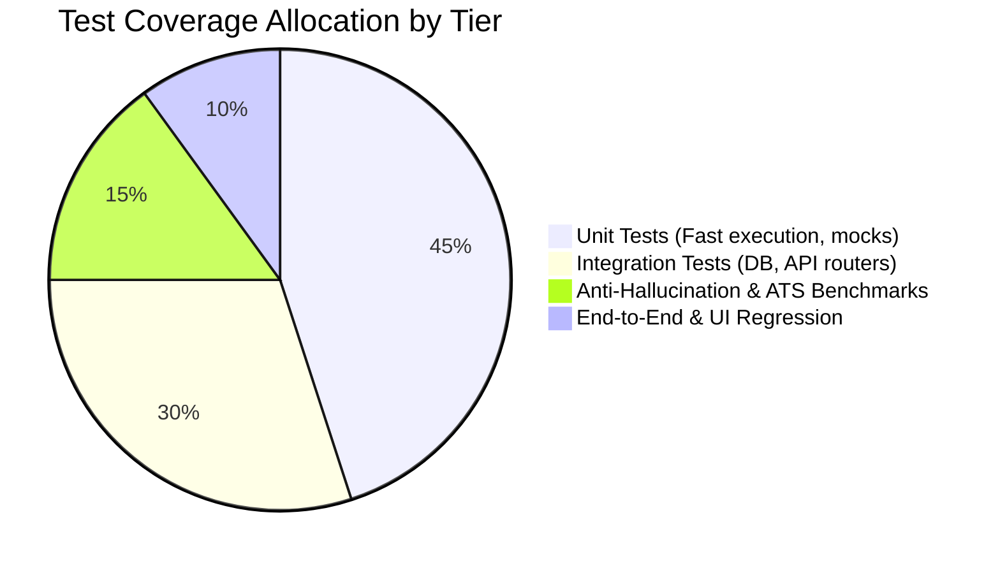
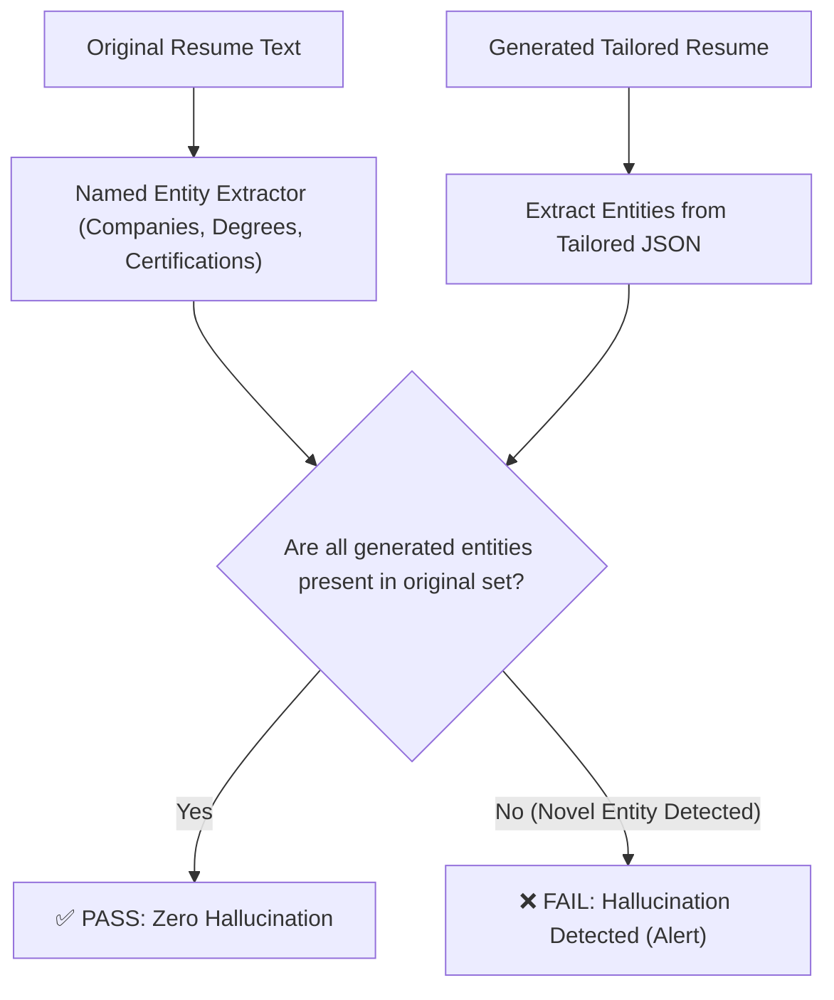

# Testing Strategy & ATS Benchmark Suite
## Project: TailorCraft AI — Automated Resume & Cover Letter Customization System

---

## 1. Testing Pyramid & QA Philosophy

The TailorCraft AI quality assurance architecture enforces reliability across four primary tiers:



* **Deterministic Verification:** Document compilers, parsers, and data normalizers are validated through automated unit tests with zero network dependencies.
* **Semantic Verification:** The AI tailoring engine is continuously benchmarked against synthetic and real-world CV/JD pairs to ensure 100% adherence to anti-hallucination guardrails and the Google XYZ formula.
* **ATS Compatibility Scoring:** Output PDFs and DOCXs are parsed by multiple simulated ATS engines to measure text extractability and keyword preservation.

---

## 2. Testing Matrix

| Test Suite | Scope | Target Modules | Primary Tooling |
| :--- | :--- | :--- | :--- |
| **Unit Tests** | Service logic, parsing, serialization | `ParserService`, `DocGenService`, `LLMService` normalizer | `pytest`, `pytest-mock` |
| **Integration Tests** | Database persistence, API router contracts | `auth`, `ingest`, `tailor`, `export` routers | `httpx.AsyncClient`, `pytest-asyncio` |
| **Anti-Hallucination**| Factual containment verification | `LLMService.tailor_application` | Custom assertion suite |
| **ATS Benchmark** | Keyword extraction fidelity & formatting | ReportLab PDF, python-docx compilers | `pdfplumber`, `pypdf`, scikit-learn |
| **Frontend UI Tests** | Component rendering, state transitions | `useWorkflow`, `AtsScoreGauge`, Editors | `Jest`, `React Testing Library` |
| **End-to-End (E2E)** | Full user workflow from upload to export | Next.js Frontend + FastAPI Backend | `Playwright` |

---

## 3. Anti-Hallucination Verification Framework

To guarantee that the AI never generates fictional experience or false credentials, TailorCraft AI employs an automated factual boundary checker.



### 3.1 Verification Test Implementation
```python
import pytest
from app.schemas.resume import StructuredResume

def verify_zero_hallucination(original_text: str, tailored: StructuredResume):
    original_lower = original_text.lower()
    
    # 1. Verify Employer Names
    for exp in tailored.work_experience:
        assert exp.company_name.lower() in original_lower or exp.company_name == "Organization", \
            f"Hallucinated company detected: {exp.company_name}"
            
    # 2. Verify Academic Institutions
    for edu in tailored.education:
        assert edu.institution.lower() in original_lower or edu.institution == "University", \
            f"Hallucinated educational institution detected: {edu.institution}"
            
    # 3. Verify Certifications
    for cert in tailored.certifications:
        assert cert.name.lower() in original_lower, \
            f"Hallucinated certification detected: {cert.name}"
```

---

## 4. Google XYZ Formula Benchmark Suite

Every generated bullet point is evaluated against Google's XYZ syntax structure:

$$\text{Regex Check: } \wedge\text{(Accomplished|Achieved|Spearheaded|Delivered|Engineered|Scaled|Optimized)}\ \dots\ \text{by}\ [0-9]+\%|\$[0-9]+|\dots$$

```python
import re

XYZ_ACTION_VERBS = [
    "accomplished", "achieved", "spearheaded", "engineered", "scaled",
    "accelerated", "optimized", "delivered", "architected", "streamlined"
]

METRIC_PATTERNS = [
    r"\b\d+%",                  # Percentages (e.g., 35%)
    r"\$\d+(?:,\d+)*(?:\.\d+)?[kKmMbB]?", # Dollar amounts (e.g., $1.2M)
    r"\b\d+x\b",                # Multipliers (e.g., 4x)
    r"\b\d+\s*(?:ms|seconds|min|hours|days)\b", # Latency/Time metrics
    r"\b\d+(?:,\d+)*\b"         # Absolute quantities
]

def score_bullet_xyz_compliance(bullet: str) -> float:
    score = 0.0
    lower = bullet.lower()
    
    # 1. Check strong active action verb
    if any(lower.startswith(verb) for verb in XYZ_ACTION_VERBS):
        score += 0.35
    elif any(verb in lower for verb in XYZ_ACTION_VERBS):
        score += 0.20
        
    # 2. Check quantifiable metric (Y component)
    if any(re.search(pat, bullet) for pat in METRIC_PATTERNS):
        score += 0.35
        
    # 3. Check methodology/action (Z component)
    if any(kw in lower for kw in ["by", "using", "through", "via", "leveraging", "implementing"]):
        score += 0.30
        
    return min(1.0, score)
```

---

## 5. ATS Readability & Keyword Fidelity Test

This benchmark verifies that compiled PDF and DOCX files preserve clean, uncorrupted text when parsed by downstream ATS parsers (`pdfplumber`, `pypdf`).

```python
import io
import pdfplumber
from app.services.document_service import DocumentGenerationService
from app.schemas.resume import StructuredResume

def test_pdf_ats_extractability(sample_structured_resume: StructuredResume):
    # 1. Compile in-memory PDF
    pdf_buffer = DocumentGenerationService.generate_resume_pdf(sample_structured_resume)
    pdf_buffer.seek(0)
    
    # 2. Extract using standard ATS parser
    extracted_text = ""
    with pdfplumber.open(pdf_buffer) as pdf:
        for page in pdf.pages:
            extracted_text += page.extract_text() or ""
            
    # 3. Assert vital candidate metadata is cleanly extractable
    assert sample_structured_resume.contact_info.full_name in extracted_text
    assert sample_structured_resume.contact_info.email in extracted_text
    for exp in sample_structured_resume.work_experience:
        assert exp.company_name in extracted_text
        assert exp.job_title in extracted_text
```

---

## 6. Test Execution & CI Automation Commands

```bash
# Run all backend unit and integration tests
cd backend
pytest -v --cov=app --cov-report=term-missing tests/

# Run specifically anti-hallucination benchmark tests
pytest -v tests/test_anti_hallucination.py

# Run document generation benchmarks
pytest -v tests/test_document_compilers.py

# Run frontend unit & component tests
cd ../frontend
npm test -- --coverage
```
